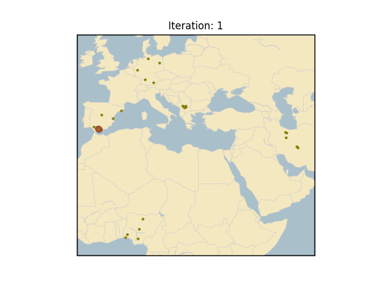
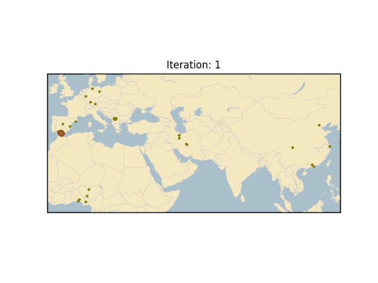
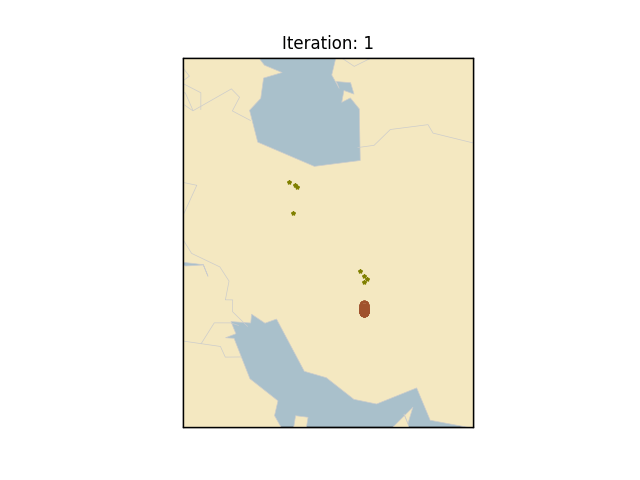
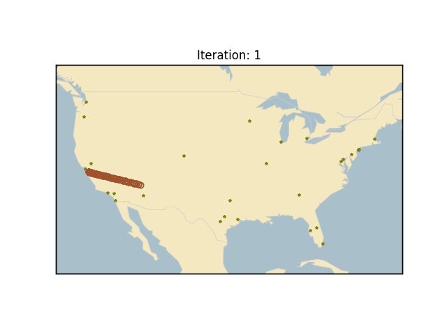

# The Sales Person (TSP) problem 
## By Mohammad Joshaghani

This project implements SOM (self-organized map) clustering algorithm aimed to solve the TSP problem.
The coordinates of the cities are read from a SQL database, and the problem is solved for the real cities!

## Getting Started

To use the codes, use the following commands:

```
# Cloning the repo
git clone https://github.com/Moh-Joshaghani/The-Sales-Person-Problem-TSP-SOM-Self-Organizing-MAP.git
# Creating the environment
conda create --name tsp --file requirements.txt
```


## Running the Python implementation
To run, simply run the main.py file:

```
python main.py --help  # prints the input arguments

# selects top 5 most populous cities from the database for the specified countries:
python main.py --countries iran germany spain kosovo nigeria china

# select the top 30 most populous cities in USA:
python main.py --countries "United States" --max_cities_per_country 30

# selecting the cities
python main.py --cities berlin madrid paris 

```

### Output
animation.gif sketches the progress of the algorithm and how the clusters change through iterations. 







