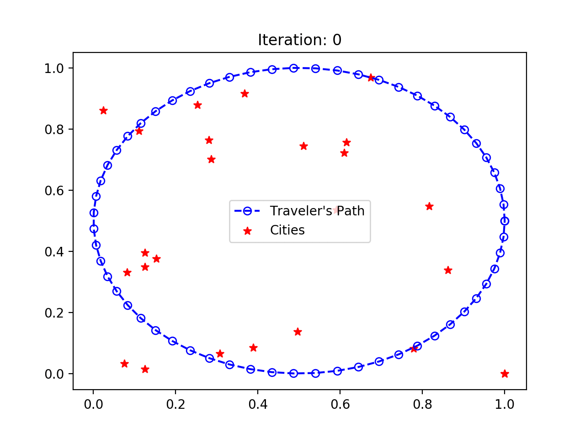

# The Sales Person (TSP) problem 
## By Mohammad Joshaghani

This project implements SOM (self-organized map) clustering algorithm aimed to solve the TSP problem. Implementation is available for in both Matlab and Python


## Getting Started

To use the codes, use the following command:
```git clone https://github.com/Moh-Joshaghani/The-Sales-Person-Problem-TSP-SOM-Self-Organizing-MAP.git```


## Running the Python implementation
To run, simply run the main.py file.

### Output
animation.gif sketches the progress of the algorithm and how the clusters change through iterations. 




